# ☁ Cloud Computing – Lab 01

### Installation of Linux (Ubuntu) using VMware Workstation Pro 17

---

### 🏫 Course

BSE (V-B)

### 👩‍🎓 Submitted By

Name: Zaheena Anwar
Roll No: 2023-BSE-070

### 👨‍🏫 Submitted To

Instructor: Sir Muhammad Shoaib

---

## 🧪 Objective

To install and configure Ubuntu 24.04.3 LTS operating system using VMware Workstation Pro 17 and verify its functionality in a virtualized environment.

---

## 🧩 Step 1: Installation of VMware Workstation Pro 17

VMware installation process started using setup wizard.
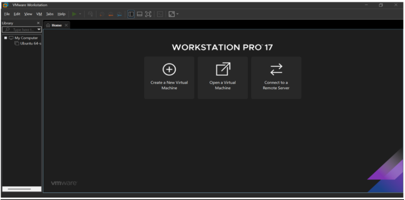

VMware installation wizard launched successfully.
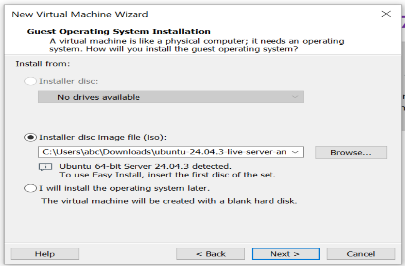

Virtual machine naming and storage configuration set.
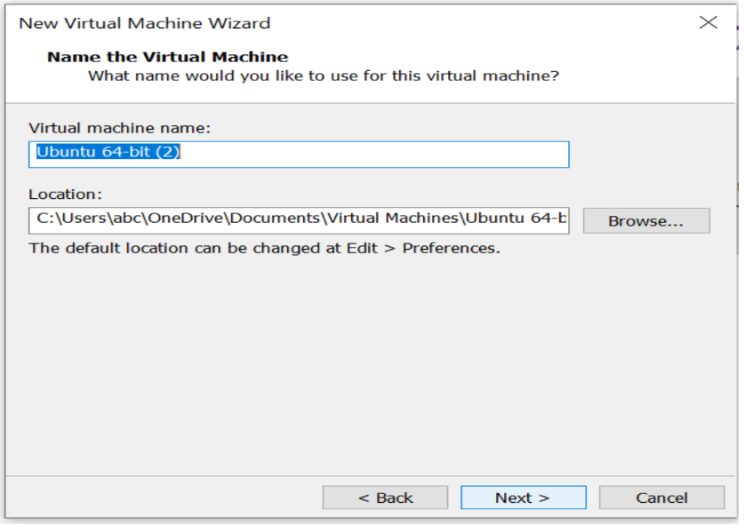

Virtual disk created for Ubuntu installation.
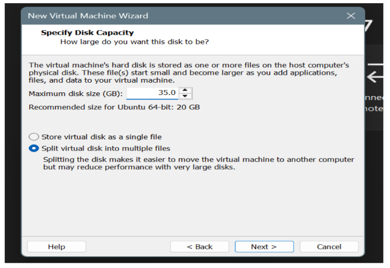

VMware processing the new machine configuration.
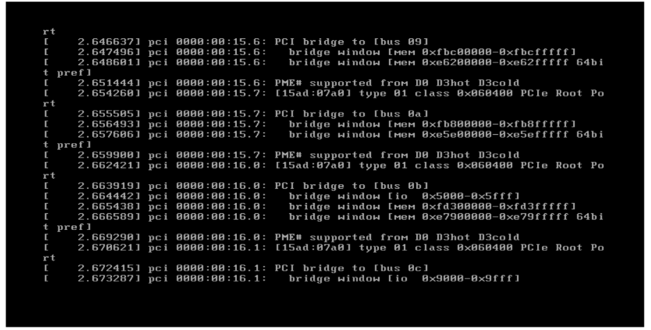

---

## 🧠 Step 2: Installation of Ubuntu 24.04.3 LTS

Ubuntu ISO selected and setup started for installation.
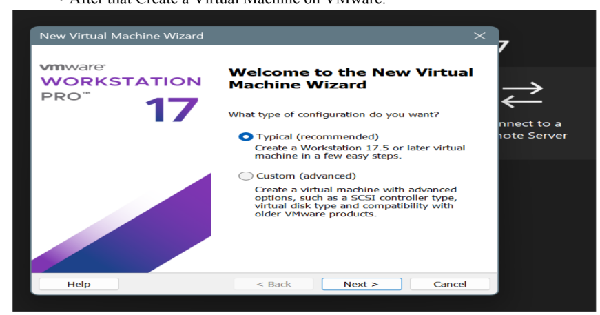

Ubuntu installation system initialized and files loading.
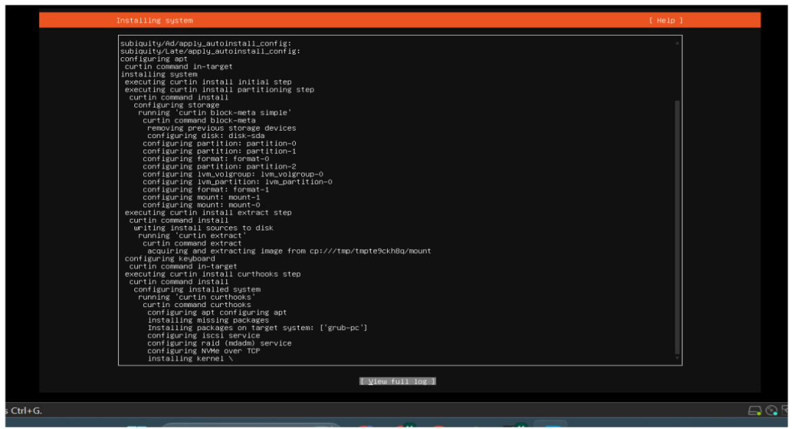

Proxy network configuration initiated during installation.
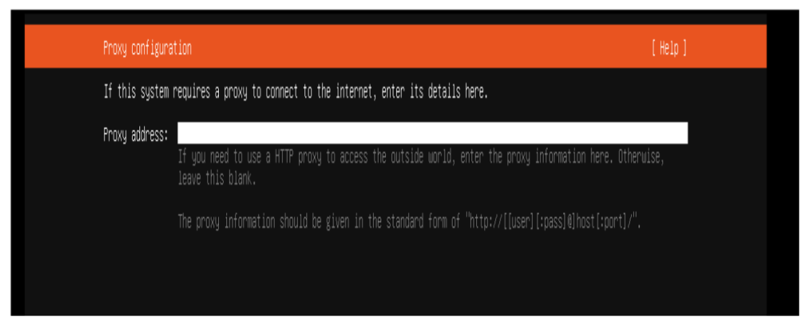

Storage configuration completed for Ubuntu partitions.
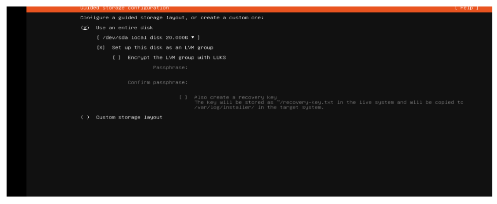

Installation process running and files being copied.

Installation continuing with setup progress visible.
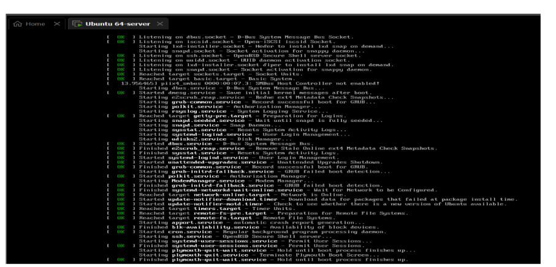

---

## 💻 Step 3: Powering On and Running Ubuntu

Virtual machine powered on after successful installation.
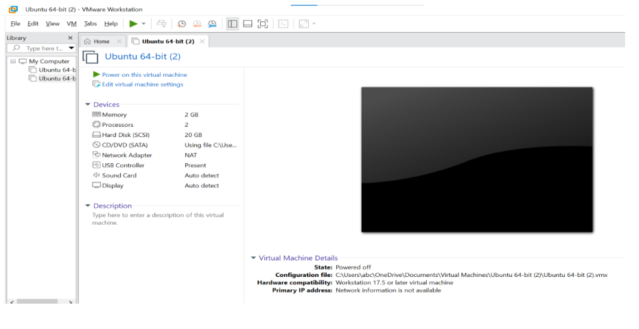

Ubuntu login screen appeared, entering credentials.
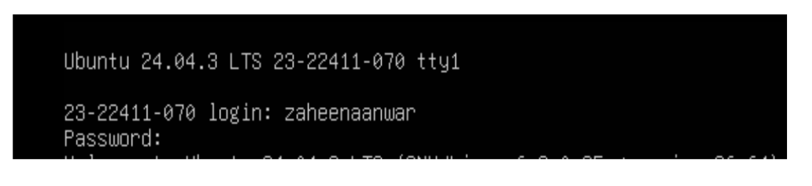

IP address verification performed inside terminal.
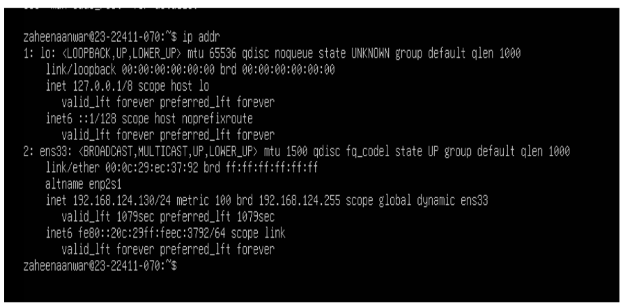

Ubuntu commands executed successfully in terminal.
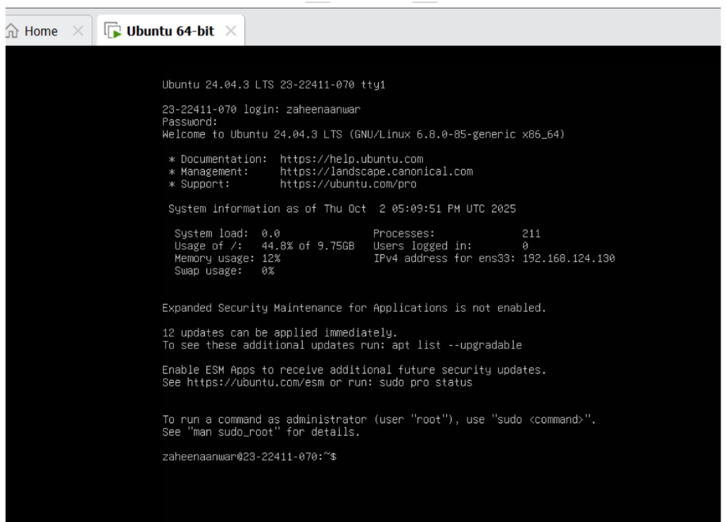

Ubuntu successfully running on VMware Workstation.

---

## ✅ Outcome

By completing this lab, we successfully:

* Installed VMware Workstation Pro 17.
* Created a virtual machine for Ubuntu.
* Installed Ubuntu 24.04.3 LTS on the VM.
* Verified that Ubuntu boots and functions properly within VMware.

---
